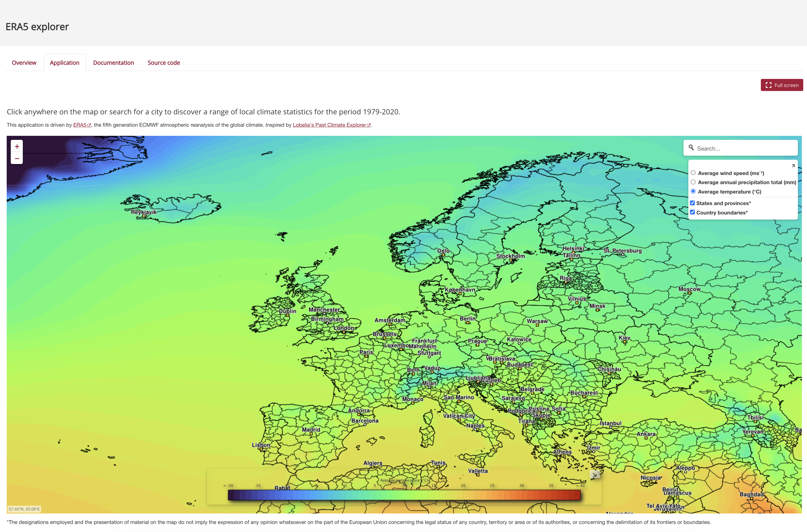

.. _overview:

Overview
========

The skinny WMS is a small WMS server that will help you to visualise your NetCDF and Grib Data. The principle is simple: skinny will browse the directory, or the single file passed as argument, and try to interpret each NetCDF or GRIB files. From the metadata, it will be built the getCapabilities document, and find a relevant style to plot the data.

